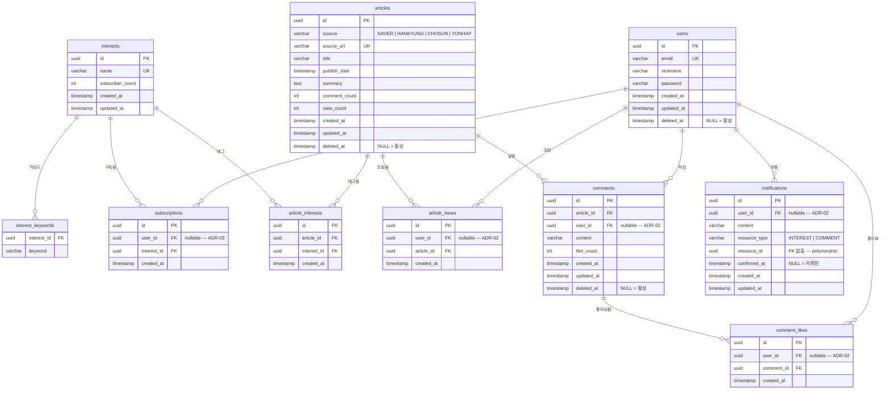

# ERD — MoNew

> 기준: `docs/draft/entity-design.md`, `src/main/resources/schema.sql`
> ADR 반영: ADR-02 (이슈 #41), ERD 최종 결정 (이슈 #40)

---

## 테이블 관계 다이어그램



---

## 테이블 설명

### users
사용자 계정. 소프트 딜리트(`deleted_at`) 후 배치로 물리 삭제.

| 컬럼 | 타입 | 설명 |
|------|------|------|
| email | VARCHAR UNIQUE | 로그인 식별자, 중복 불가 |
| nickname | VARCHAR | 수정 가능한 표시 이름 |
| deleted_at | TIMESTAMP | NULL = 활성, NOT NULL = 논리 삭제 |

---

### interests
관심사(토픽). 키워드 기반으로 뉴스 기사를 필터링.

| 컬럼 | 타입 | 설명 |
|------|------|------|
| name | VARCHAR UNIQUE | 유사도 80% 이상 중복 방지 (서비스 레이어) |
| subscriber_count | INT | 구독자 수 캐시 |

---

### interest_keywords
`@ElementCollection` 매핑. 복합 PK `(interest_id, keyword)`.

---

### subscriptions
사용자-관심사 구독 관계. `UNIQUE (user_id, interest_id)`.
> **ADR-02**: 사용자 물리 삭제 시 `user_id` SET NULL (구독 레코드 보존).

---

### articles
뉴스 기사. 배치 수집(Naver API + RSS 4곳), 매시간.

| 컬럼 | 타입 | 설명 |
|------|------|------|
| source | VARCHAR(20) CHECK | NAVER / HANKYUNG / CHOSUN / YONHAP |
| source_url | VARCHAR UNIQUE | 중복 수집 방지 |
| comment_count | INT | 카운터 캐시 |
| view_count | INT | 중복 제거된 조회수 캐시 |
| deleted_at | TIMESTAMP | 논리 삭제 |

---

### article_interests
기사-관심사 태그 관계 (@ManyToMany 대체 join 엔티티). `UNIQUE (article_id, interest_id)`.

---

### article_views
기사 조회 이력. `UNIQUE (user_id, article_id)`로 동일 사용자 중복 조회 1회 처리.
> **ADR-02**: 사용자 물리 삭제 시 `user_id` SET NULL (조회 이력 보존).

---

### comments
기사 댓글. 소프트 딜리트.

| 컬럼 | 타입 | 설명 |
|------|------|------|
| content | VARCHAR(500) | 댓글 본문 |
| like_count | INT | 카운터 캐시 |

> **ADR-02**: 기사 삭제 시 CASCADE. 사용자 물리 삭제 시 `user_id` SET NULL (댓글 내용 보존).

---

### comment_likes
댓글 좋아요. `UNIQUE (user_id, comment_id)`로 중복 좋아요 방지.
> **ADR-02**: 댓글 삭제 시 CASCADE. 사용자 물리 삭제 시 `user_id` SET NULL.

---

### notifications
알림. 트리거: 구독 관심사 기사 등록 / 댓글 좋아요.

| 컬럼 | 타입 | 설명 |
|------|------|------|
| resource_type | VARCHAR | `INTEREST` \| `COMMENT` (polymorphic) |
| resource_id | UUID | FK 없음 — 다형성 참조 |
| confirmed_at | TIMESTAMP | NULL = 미확인. 확인 후 7일 경과 시 배치 삭제 |

> **ADR-02**: 사용자 물리 삭제 시 `user_id` SET NULL.

---

## ADR 결정 요약

### ADR-02 — User 물리 삭제 cascade 처리 (이슈 #41, 안 C 채택)

| 삭제 트리거 | 대상 | 처리 |
|------------|------|------|
| 기사 삭제 | `comments` | CASCADE |
| 기사 삭제 | `comment_likes` (comments 통해) | CASCADE |
| 기사 삭제 | `article_interests`, `article_views` | CASCADE |
| 사용자 물리 삭제 | `comments.user_id` | SET NULL |
| 사용자 물리 삭제 | `comment_likes.user_id` | SET NULL |
| 사용자 물리 삭제 | `subscriptions.user_id` | SET NULL |
| 사용자 물리 삭제 | `article_views.user_id` | SET NULL |
| 사용자 물리 삭제 | `notifications.user_id` | SET NULL |

**근거**: 탈퇴한 사용자의 댓글과 활동 이력을 보존하여 다른 사용자의 컨텍스트 유지.

---

## 인덱스 설계

| 테이블 | 컬럼 | 용도 |
|--------|------|------|
| `users` | `email` (UK) | 로그인·중복 체크 |
| `users` | `deleted_at` WHERE NULL | 활성 사용자 조회 |
| `interests` | `subscriber_count` | 구독자 수 정렬 |
| `subscriptions` | `user_id`, `interest_id` | 구독 목록 조회 |
| `articles` | `publish_date` | 날짜 정렬 커서 페이지네이션 |
| `articles` | `comment_count`, `view_count` | 정렬 커서 페이지네이션 |
| `articles` | `deleted_at` WHERE NULL | 활성 기사 필터 |
| `article_interests` | `article_id`, `interest_id` | 관심사-기사 조인 |
| `article_views` | `user_id`, `article_id` | 중복 조회 방지 조회 |
| `comments` | `article_id`, `user_id` | 기사별·사용자별 댓글 조회 |
| `comments` | `like_count` | 좋아요 수 정렬 |
| `comments` | `deleted_at` WHERE NULL | 활성 댓글 필터 |
| `comment_likes` | `user_id`, `comment_id` | 중복 좋아요 방지 조회 |
| `notifications` | `user_id` | 사용자별 알림 조회 |
| `notifications` | `(user_id, created_at)` WHERE confirmed_at IS NULL | 미확인 알림 조회 |

---

## MongoDB — user_activities 컬렉션 (Phase 2)

사용자 활동 내역 API(`GET /api/user-activities/{userId}`)에서 구독·댓글·좋아요·조회 이력을 한 번에 반환하기 위해 역정규화 Read Model을 MongoDB에 별도 운영.

```json
{
  "_id": "user-uuid",
  "email": "user@monew.com",
  "nickname": "닉네임",
  "createdAt": "2026-05-26T10:00:00Z",
  "subscriptions": [
    { "id": "subscription-uuid", "interestId": "interest-uuid", "interestName": "IT",
      "interestKeywords": ["인공지능", "클라우드"], "subscriberCount": 42, "createdAt": "..." }
  ],
  "comments": [
    { "id": "comment-uuid", "articleId": "article-uuid", "articleTitle": "기사 제목",
      "content": "댓글 내용", "likeCount": 5, "createdAt": "..." }
  ],
  "commentLikes": [
    { "id": "like-uuid", "commentId": "comment-uuid", "articleId": "article-uuid",
      "articleTitle": "기사 제목", "commentContent": "댓글 내용",
      "commentOwnerNickname": "작성자", "likeCount": 5, "createdAt": "..." }
  ],
  "articleViews": [
    { "id": "view-uuid", "articleId": "article-uuid", "source": "NAVER",
      "sourceUrl": "https://...", "articleTitle": "기사 제목",
      "articlePublishedDate": "...", "articleSummary": "...",
      "commentCount": 10, "viewCount": 100, "createdAt": "..." }
  ],
  "updatedAt": "2026-05-26T14:00:00Z"
}
```

> 동기화: 각 활동(구독, 댓글 작성, 좋아요, 기사 조회) 발생 시 PostgreSQL 트랜잭션 완료 후 해당 도큐먼트 Upsert.
